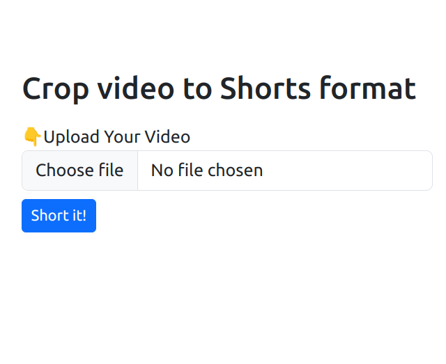

# Merge For Shorts


## 🤝 Support
If you like the project please do consider supporting me 🙏 

<br>

<a href='https://ko-fi.com/S6S3UJ4NY' target='_blank'></a>

<a href="https://www.buymeacoffee.com/gjohnpinto" target="_blank" align="center"></a>


## ⚙️ Functionalities
- Crop a video to shorts format
- Merge videos for shorts


<!-- > Sepcial thanks to reddit user [u/ximo23](https://www.reddit.com/user/ximo23). -->


## Requirements
- This requires `python 3.9` or higher versions

## ⬇️ Installation

 - Clone repo 
 ```
 git clone https://github.com/pj8912/merge-for-shorts.git
 ```
 - Create you `venv`(I use [myenv](https://github.com/pj8912/myenv))

 - Install  dependencies :  
 ```
 pip install -r requirements.txt
 ```

## 🏃 Start 

- To run the Flask application, you can use the following command:
```
python app.py 
```
- Open http://localhost:5000

## Working
- This will start the Flask development server and you can access the application by visiting `http://localhost:5000` in your web browser.

- The format of the video is any movie or tv series clip at the top and random videogame or life hacks videos at the bottom.

- The application allows users to upload an video file which sits at the top and video game at the bottom which is in the `uploads` folder - `quake_short.mp4` , where two of them are combined to form a single video file which is <= `1 minute`. If the video uploaded by the user is greater than a minute it will be reduced to a minute. The progress can be seen on the terminal.  


## 📸 Screenshots

### Home


### Crop to shorts


### Merge video


#### other  example
- Check out this [Youtube](https://www.youtube.com/shorts/vQst9hvQXKI) video
- `Family Guy` video at the top and `quake` video at the bottom


## Configuration

- You can configure the application by modifying the config dictionary in the `app.py` file. You can set the location and name of the folder where uploaded files will be saved, as well as the maximum allowed file size.

## Contributors

- [jp](https://github.com/pj8912)

## License
This project is licensed under the Apache License Version 2.0.

## Contribution

 - The goal of this project is to convert individual videos to shorts format and automate the process of making vertical `shorts` videos of a certain kind. 
 - Contributions are always welcome, no matter how large or small. Pull requests are always welcome, and I'll do my best to do reviews as fast as I can. 

In the case of a bug report, bugfix or a suggestions, please feel very free to open an issue too.

